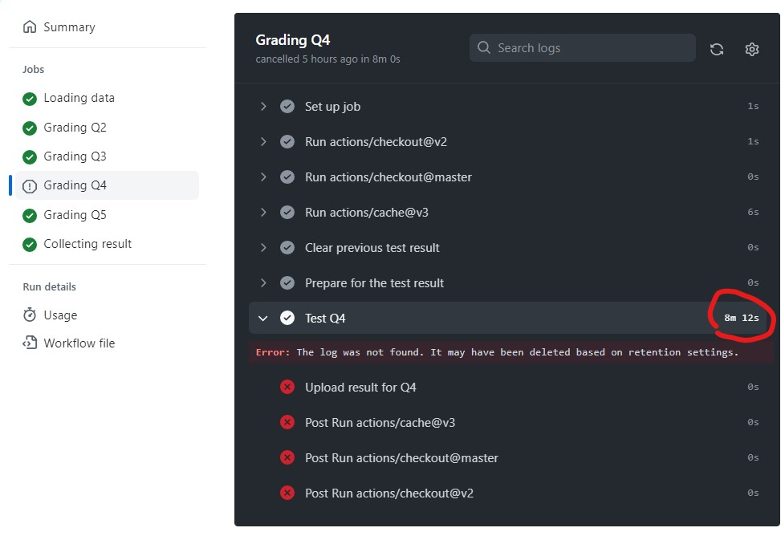
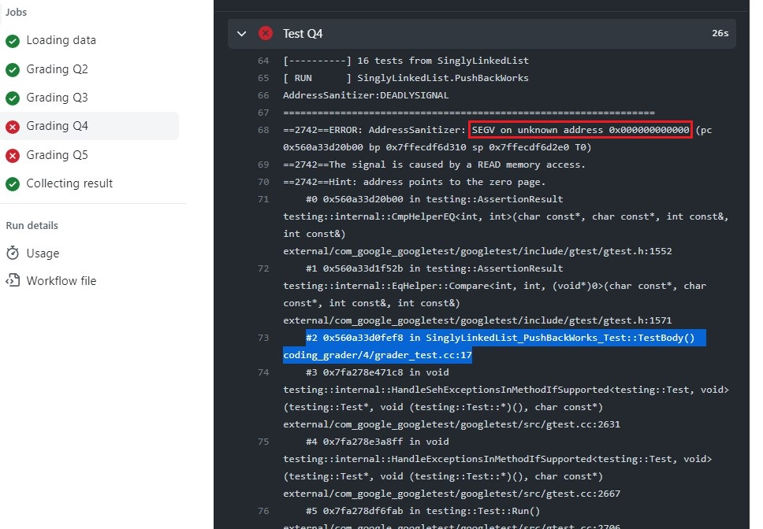
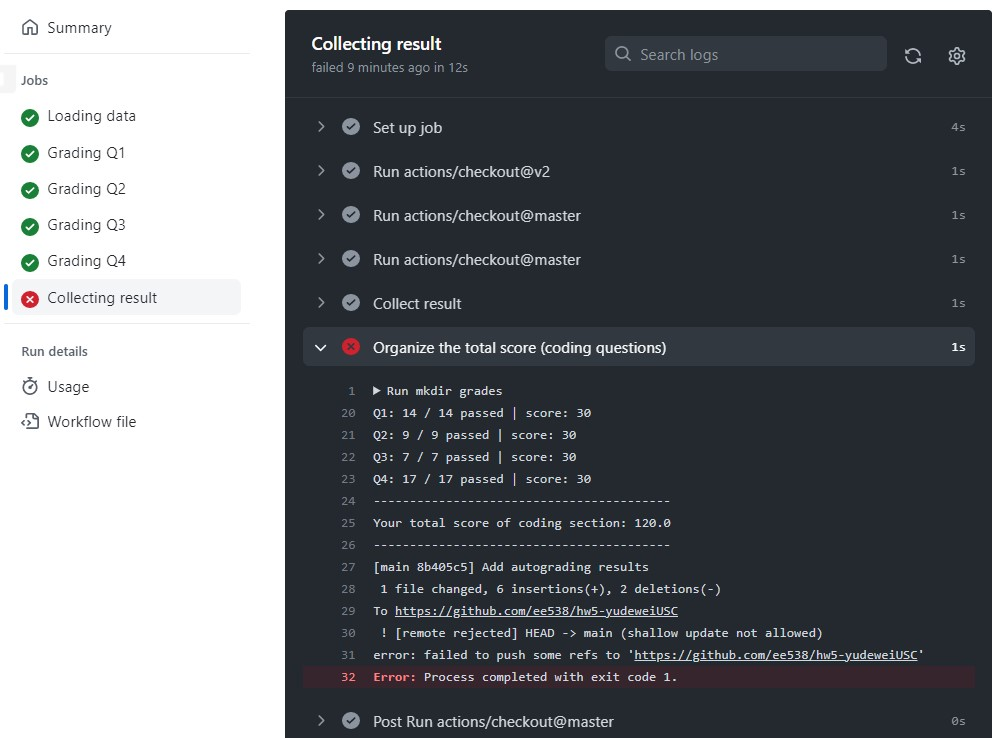
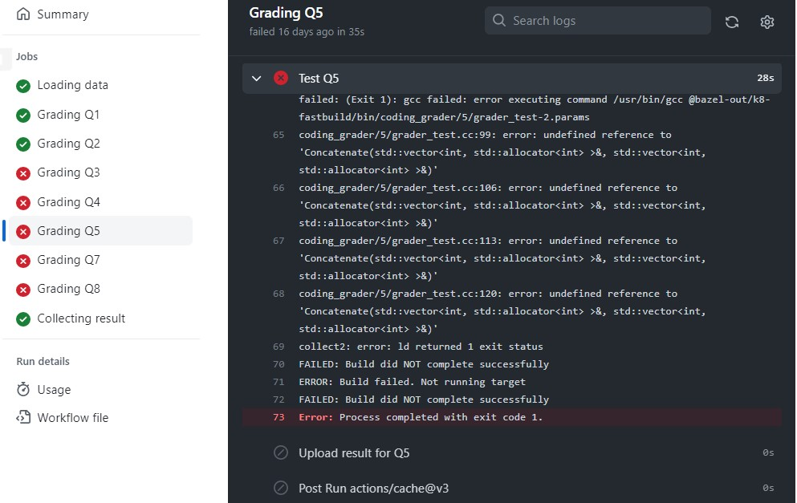
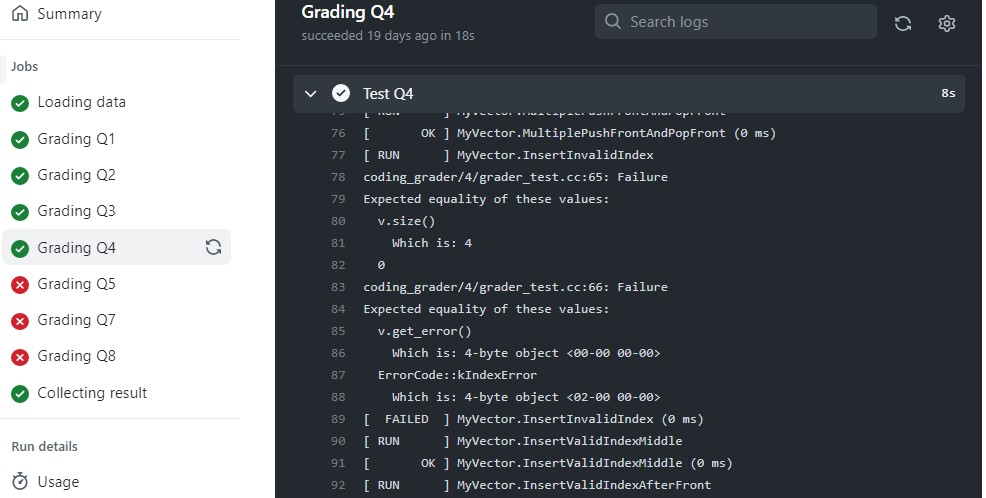

[V 0.1](https://viterbi-web.usc.edu/~yudewei/main/sources/gradingscript/) on 10/18/2022

### Q1

- My grading workflow **was running for rather long time** on a certain question and I finally only got some message like: **`Error:`** `The log was not found. It may have been deleted based on retention settings. ` without anything else. You please don't care whether my code passes the tests locally, but the grading script doesn't work anyway! 

  

### A1

- That means your code runs for too long time and causes the timeout of the grading script to expire. Up to now, all of these issues are caused by **infinite loops** in students' code, so please double check that in your code.
- A practical advice is to write some tests trying to cover multiple cases and pass them locally first before you push your code to GitHub. You may **step through** your code to find the bug and please feel free to ask questions on it after you do the above.

### Q2

- I have passed all my test cases locally but I got **memory misuse errors** as follow when running the grading script. I don't understand what those errors mean given by the grading script.

  

  

  

### A2

- We use `--config=asan` flag to detect memory misuse in your code. You may think of which part in your code may cause the memory misuse from the specific hints (like ` stack-buffer-overflow `, `SEGV on unknown address xxx`, `memory leak` etc.) given by the address sanitizer.

- You should write some tests trying to cover multiple cases and pass them locally first before you push your code to GitHub. You may **step through** your code to the crash position and go to the **call stack** where you should pay attention to **the part that is in our code** to find the bug.

  | Error Message from the Grading Script | Possible Reason and Solution                                 |
  | ------------------------------------- | ------------------------------------------------------------ |
  | ` stack-buffer-overflow `             | You might access a position outside of an array (or vector, etc.), which may probably happen in your **loop block**. You may check the boundary conditions of related loop statement. |
  | `SEGV on unknown address xxx`         | - If the `xxx` is `0x00`, it is likely that you were **dereferencing a `nullptr`**. You should **check the corner cases** in you code in that case.   - If the `xxx` is something other than `0x00`, you might assign a non-accessible address to a pointer before you accessed the value of that pointer. |
  | `memory leak`                         | - That means you **didn't delete** a memory after using `new`. The destructor of a class will not be called automatically if you store the object in heap memory with `new` operator. You should always remember to delete all of the new'ed memory. - If you think that you have already deleted the memory, you may check if you have mixed `delete` and `delete []`. |

### Q3

- The grading script shows that I have passed all tests but I got a certain **error in the last step** as follow. Why is the grading script not working?

### A3

- The error is caused by the conflict when updating your total score. That may because you were pushing your code too fast before the grading script could finish grading your previous submission. You may **slow down your push operation** since it typically takes the grading script no more than 3 minutes to grade your submission. To solve this, you just need to **push again your newer code** and everything will be fine.

- If you were attempting to use the grading script to test your code before you write some tests and pass them locally, you are recommended to pass your test cases locally first because the grading script doesn't work that way. The grading script is not so invulnerable, so please use it properly and don't play with it.

### Q4

- My code was running well locally and passed the tests I have in `student_test.cc`, but I got **undefined reference** errors when pushing to GitHub as follow. Did I miss something to satisfy the grading script?

  

  

### A4

- You should first **make sure you have implemented all the required functions declared in the header files properly**. If you think you did, you may **check whether you have modified the header file unintentionally**, since the grading script will always use its header files (not yours) that are the ones distributed originally to grade your code. You may also check **whether you should call a function directly or need to have an object to call its method** and **whether you should add scope resolution operators to your definition of the functions**.

### Q5

- I found there is a logic issue in the grader test where the second expected value should not be the one as shown. Is my code wrong or is the grading script wrong?

### A5

- Not sure. But I should say there may be more than one assertion in one test case and there may be some other operations between the two assertion statements, so the expected result of the second assertion may not be the one we use for the first assertion. So feel free to post your questions on Piazza after you pass some tests locally.
